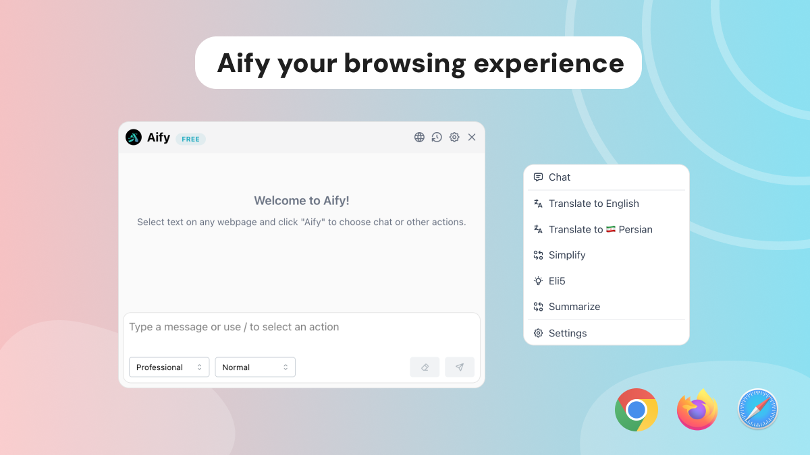

# Aify Browser Extension



A minimal and powerful AI assistant that enhances your browsing experience with text transformations and translations.

## Features

- 🚀 Quick text actions and transformations
- 🌍 Multi-language translation support
- ⚙️ Customizable actions and settings
- 🔌 Support for custom OpenAI-compatible APIs
- 🎯 One-click default actions
- 💪 Minimal, clean, and professional UI

### Installation

#### Direct Download

1. Download the latest version for your browser from [GitHub Releases](https://github.com/amirrezasalimi/aify/releases)
2. For Chrome/Chromium browsers:
   - Open chrome://extensions
   - Enable "Developer mode"
   - Click "Load unpacked"
   - Select the extracted extension directory

## Development

Built with:

- WXT (Browser Extension Framework)
- React
- Mantine UI v7
- TailwindCSS

## Build and Installation

### Development Setup

```bash
# Install dependencies
npm install

# Start development server
npm run dev
```

### Building for Browsers

```bash
# Build for all browsers
npm run build

# Build for specific browser
npm run build:firefox
```

The built extensions will be available in the `dist` directory.

#### Build from Source

##### Chrome

1. Open chrome://extensions
2. Enable "Developer mode"
3. Click "Load unpacked"
4. Select the `dist/chrome` directory

##### Firefox

1. Open about:debugging
2. Click "This Firefox"
3. Click "Load Temporary Add-on"
4. Select any file from the `dist/firefox` directory

## Usage Considerations

This extension is open-source and free for personal use only. Commercial use is not permitted without explicit permission.

## Contributing

Contributions are welcome! If you'd like to contribute to Aify, feel free to open issues or submit pull requests.
